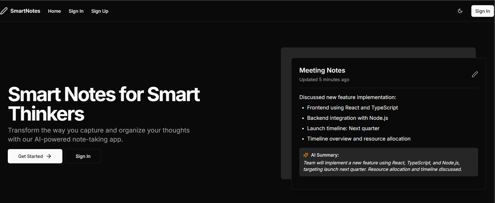

# 📝 AInote - Smart Notes for Smart Thinkers

Transform the way you capture and organize your thoughts with **AInote**, an AI-powered note-taking app that automatically summarizes your content in real time. Built with modern web technologies for a seamless and intelligent user experience.

[🌐 Live Demo](https://a-inote.vercel.app/dashboard)

---

## 🚀 Features

- ✨ **AI-Powered Summaries**  
  Get concise, meaningful summaries of your notes automatically.

- 🖋️ **Rich Note Editor**  
  Easily write, update, and manage notes with a clean and intuitive interface.

- 🔒 **User Authentication**  
  Sign up and log in securely using Supabase Auth.

- 🧠 **Real-Time Sync**  
  Notes are stored and updated in real time using Supabase database.

- 🌗 **Dark Mode Support**  
  Toggle between light and dark themes to match your style.

---

## 📸 Preview



> **Smart Notes for Smart Thinkers** – A modern solution for organized, efficient, and AI-augmented note-taking.

---

## 🛠️ Built With

- [Next.js](https://nextjs.org/)
- [React](https://react.dev/)
- [Supabase](https://supabase.io/) (Auth + Realtime DB + Edge Functions)
- [TypeScript](https://www.typescriptlang.org/)
- [Tailwind CSS](https://tailwindcss.com/)
- [OpenAI API](https://platform.openai.com/) (for AI-generated summaries)
- [React Query](https://tanstack.com/query/latest) (for data fetching & caching)

---

## 🚀 Getting Started

Follow these steps to run AInote locally:

### 1. Clone the repository

```bash
git clone https://github.com/nitinc4/AInote.git
cd AInote
```

### 2. Install dependencies

```bash
npm install
```

### 3. Set up environment variables

Create a `.env.local` file in the root directory and add the following:

```env
NEXT_PUBLIC_SUPABASE_URL=your_supabase_url
NEXT_PUBLIC_SUPABASE_ANON_KEY=your_supabase_anon_key
OPENAI_API_KEY=your_openai_api_key
```

### 4. Run the development server

```bash
npm run dev
```

Visit [http://localhost:3000](http://localhost:3000) to open the app in your browser.

---

## 📂 Project Structure

```
/components      → Reusable React components  
/hooks           → Custom hooks  
/pages           → Next.js routes  
/supabase        → Supabase client and helpers  
/types           → TypeScript type definitions  
/utils           → Utility functions  
```

---

## 📈 Roadmap

- [ ] Folder/tag organization for notes  
- [ ] Collaborative notes / sharing  
- [ ] Full markdown support  
- [ ] Mobile PWA support  
- [ ] Offline mode  

---

## 🤝 Contributing

Contributions are welcome! Please fork the repo and submit a pull request.  
If you find any bugs or have feature suggestions, feel free to open an issue.

---

## 📄 License

This project is licensed under the MIT License.

---

## 🙌 Acknowledgements

- [OpenAI](https://openai.com/)
- [Supabase](https://supabase.io/)
- [Vercel](https://vercel.com/)
- [Shadcn/UI](https://ui.shadcn.com/) for clean components
- [TailwindCSS](https://tailwindcss.com/) for styling
